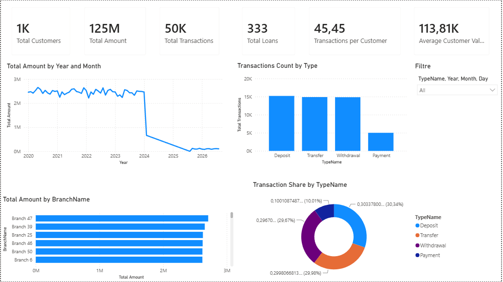
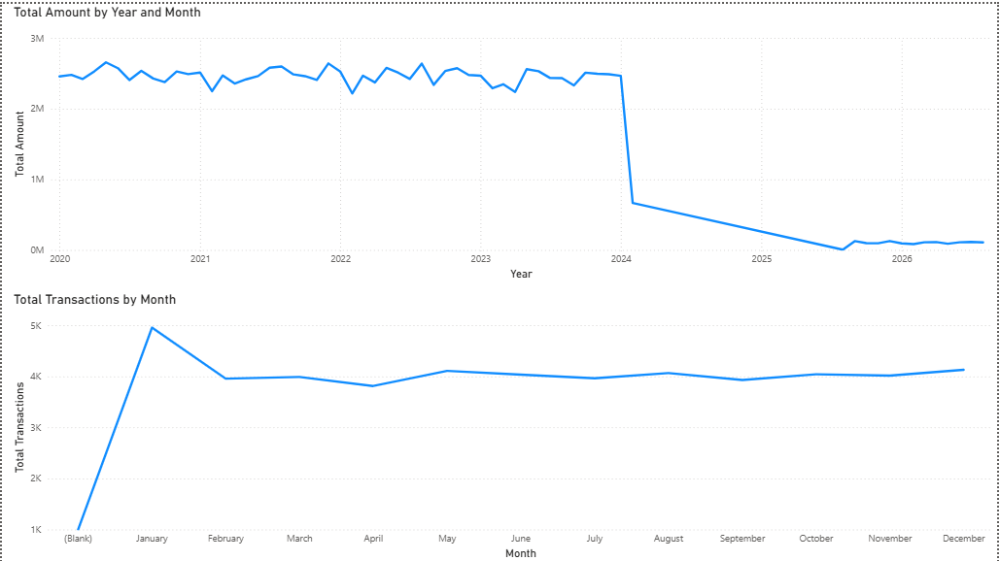
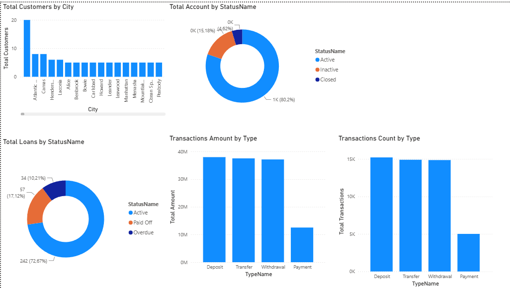
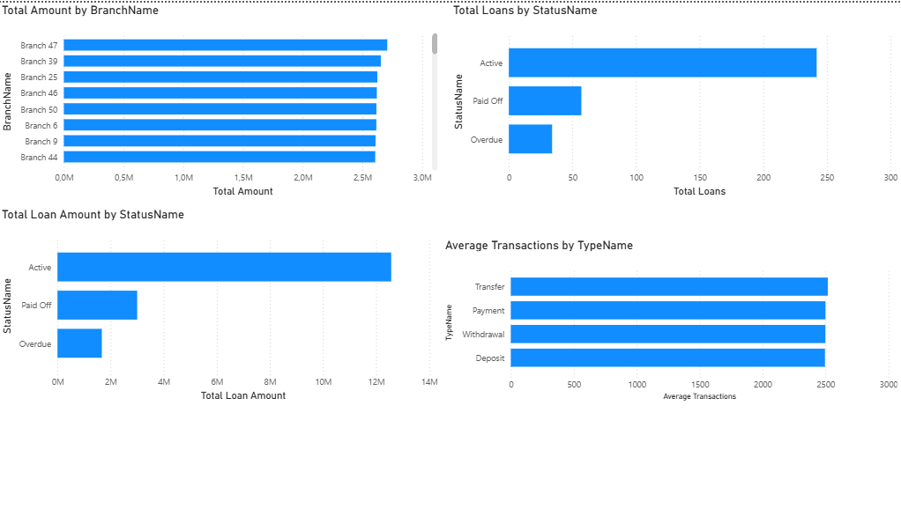

# Banking Analytics Dashboard (Power BI)

## 📌 Project Overview

This project is an interactive banking analytics dashboard built in **Microsoft Power BI**.

The dashboard provides insights into customer activity, transactions, accounts, loans, and branch performance. The project demonstrates data modeling, Power Query transformations, DAX calculations, and dashboard design.

---

## 📂 Dataset

The dataset contains the following tables:

- Customers
- Customer Types
- Accounts
- Account Types
- Account Statuses
- Transactions
- Transaction Types
- Loans
- Loan Statuses
- Branches
- Addresses

---

## 🛠 Data Preparation

Data preprocessing was performed using **Power Query**.

The following transformations were applied:

- Data type conversion
- Text-to-number conversion
- Date conversion
- Duplicate removal
- Relationship preparation
- Data cleaning

---

## 📊 Dashboard Features

The report includes:

- Executive Dashboard
- Customer Analysis
- Transaction Analysis
- Loan Analysis

Main KPIs:

- Total Customers
- Total Transactions
- Total Transaction Amount
- Total Loans
- Average Transactions per Customer
- Average Customer Value

Interactive filtering allows users to analyze data by transaction type and date.

---

## 📈 DAX Measures

Examples of implemented DAX calculations:

- Total Transaction Amount
- Average Transaction Amount
- Total Loans
- Average Loan Amount
- Transactions per Customer
- Average Customer Value
- Transaction Share

---

## 🧰 Technologies

- Microsoft Power BI
- Power Query
- DAX
- CSV

---

## 📷 Dashboard Preview

### Overview

### Transactions

### Customers

### Loans

---

## 🎯 Project Purpose

The goal of this project was to practice:

- Power BI dashboard development
- Data modeling
- Power Query transformations
- DAX calculations
- Business data visualization

This project was created as part of my portfolio for Junior Data Analyst / BI Analyst positions.

## 👤 Author

Vitaliy

GitHub: (https://github.com/livegonebis-ctrl)
